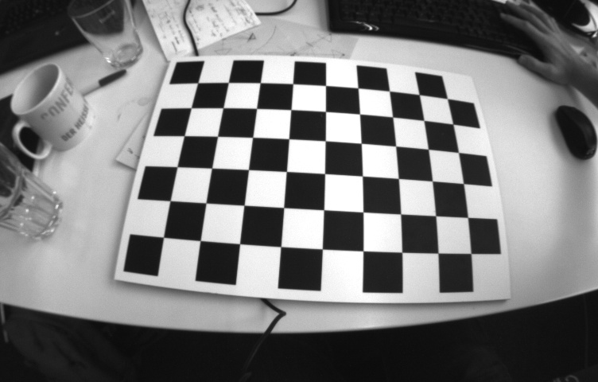
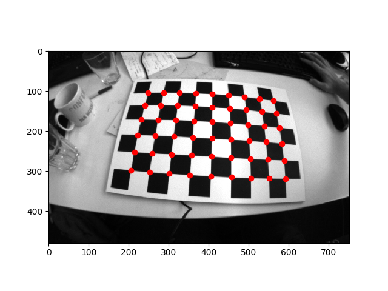
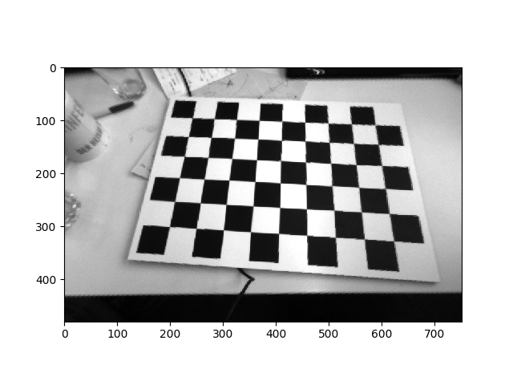
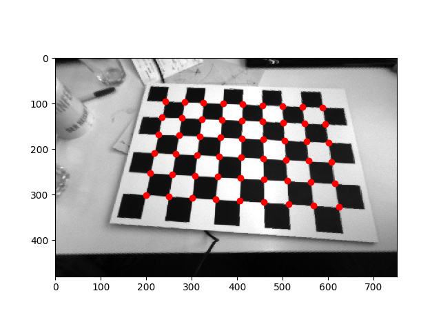

# Augmented reality wireframe cube

The goal of this exercise is to superimpose a virtual cube on a video of a planar grid viewed from different orientations. This also helps to familiarize with the basics of perspective projection, change of coordinate systems and lens distortion, as well as basic image processing.

## Projecting Points on the Image

Consider the distorted image:

Projecting the points on the above image,

|       Projection of Points before Distortion of Points       |       Projection of Points after Distortion of Points        |
| :----------------------------------------------------------: | :----------------------------------------------------------: |
|  |  |

## Undistorting the Image

|                       Distorted Image                        |                      Undistorted Image                       |
| :----------------------------------------------------------: | :----------------------------------------------------------: |
|  |  |

Projecting the points after Undistorting the image,

## Projecting a cube on the Image

